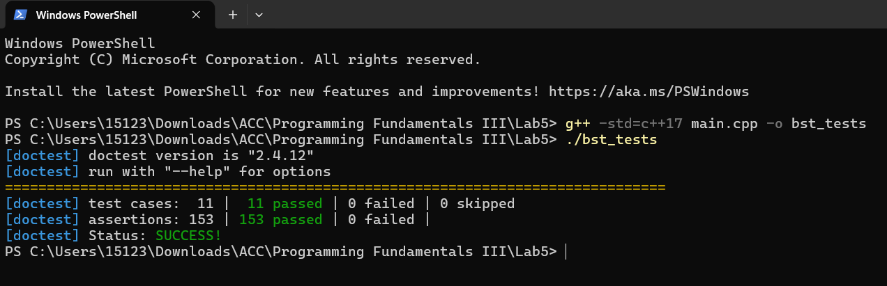

# C++ Binary Trees and Binary Search Trees

This project implements both an unordered Binary Tree and an ordered Binary Search Tree in C++ using templates, smart pointers, recursion, and automated unit tests.

The project was developed as part of computer science coursework and demonstrates core data structure implementation using modern C++ techniques.

---

## Features

* Binary tree node implementation using templates
* Unordered Binary Tree insertion with balanced add logic
* Binary Search Tree insertion maintaining BST ordering
* Binary tree and BST removal operations
* Tree traversal algorithms:

  * preorder
  * inorder
  * postorder
* Tree height calculation
* Node counting
* Search operations
* Tree copy functionality
* Tree sort using BST inorder traversal
* Automated unit tests using doctest

---

## Concepts Demonstrated

* Object-oriented programming in C++
* Template programming
* Smart pointers (`std::shared_ptr`)
* Recursive algorithms
* Binary Tree and Binary Search Tree logic
* Tree traversal strategies
* Unit testing

---

## Project Structure

```text
cpp-binary-search-tree
│
├── main.cpp      # Binary Tree / BST implementation and unit tests
├── doctest.h     # External testing framework dependency
└── README.md
```

---

## How to Compile

Compile using g++:

```bash
g++ -std=c++17 main.cpp -o bst_tests
```

---

## Run

```bash
./bst_tests
```

Running the program executes the built-in automated unit tests.

---

## Example Output

After running the program, all test cases should pass successfully.

Example:



---

## Note on Testing Framework

This project uses the single-header `doctest` framework for unit testing.

* `main.cpp` contains my Binary Tree and Binary Search Tree implementation
* `doctest.h` is an external open-source dependency used only for testing

---

## Authorship

The Binary Tree, Binary Search Tree, traversal logic, search, removal, and tree sort implementation are my coursework implementation.

The file `doctest.h` is an external testing library and is not my original code.

---

## Author

John Pleasant
Computer Science Student
